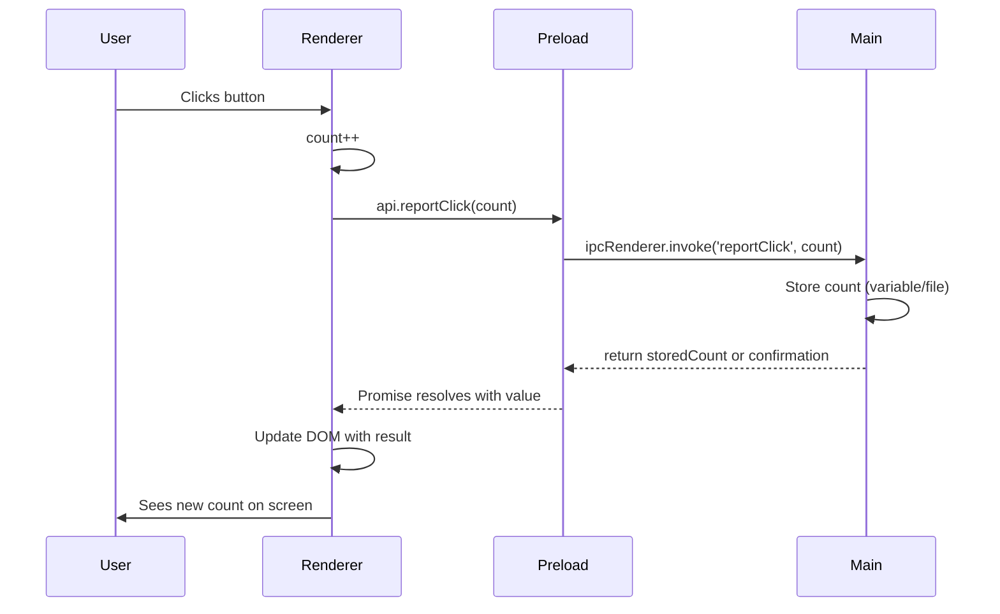

# Electron IPC: The "Loop" Between UI and Main Process

## Terminology

What you're calling the "electron loop" is usually called **IPC (Inter-Process Communication)** or the **main ↔ renderer flow**.

- **Main process**: The Node.js process that runs your `main.js`. There is only one. It can use Node APIs, the filesystem, and create windows.
- **Renderer process**: One per browser window. It runs your HTML/CSS/JS (e.g. `renderer.js`, `index.html`). For security it does **not** have direct access to Node or to the main process.
- **Preload script**: Runs in a special context **before** the page loads. It can use Node and talk to the main process. Its job is to expose a small, safe API to the page via `contextBridge.exposeInMainWorld()`.
- **IPC**: How the renderer and main process talk. The renderer **invokes** a channel; the main process **handles** that channel and can return a value or send messages back.

So the "loop" is: **Renderer (UI) → Preload (bridge) → Main process (logic/storage) → back to Renderer (update UI)**.

---

## Why You Saw `[object Object]`

Your main handler is:

```js
ipcMain.handle('ping', (count) => `I clicked this button ${count} times`)
```

The **first argument** to an `ipcMain.handle` callback is always the **IPC event** (an object). You never sent the numeric count from the renderer, so:

- Renderer calls `api.ping()` with no arguments.
- Main receives that one "first" argument: the **event** object.
- So `count` in the handler is actually the event → when you do `${count}` you get `[object Object]`.

So the flow was wrong in two places:

1. The renderer never sent the count (you had `func(count)` but `func` didn’t use it and didn’t pass it to `ping`).
2. The preload’s `ping` didn’t accept or forward any argument to `ipcRenderer.invoke('ping', ...)`.

Fixing both (see below) will send the real number and show "I clicked this button 3 times" (or whatever the count is).

---

## The Correct Flow (Request–Response)

For "click → send count to main → main stores it → show it back in the UI", this is the right pattern:



1. **Renderer**: On click, increment local count, call `api.reportClick(count)` (or similar), and when the promise resolves, update the UI (e.g. set `versionInfo.innerText` or a dedicated element to the returned message/count).
2. **Preload**: Exposes one method, e.g. `reportClick: (count) => ipcRenderer.invoke('reportClick', count)`, so the renderer can’t touch other channels or Node.
3. **Main**: `ipcMain.handle('reportClick', (event, count) => { ... })`. Note: **first parameter is event, second is your payload.** Store the count (variable, or write to a file if you need persistence). Return a string or number (e.g. the new count or a message). That return value is what the renderer gets from the promise.

So: **you are not wrong to want "click → main stores → show back"**. The right approach is exactly this request–response over IPC; you just need to pass the count through the chain and use the handler’s second parameter.

---

## Who holds state? (Including the count)

- **Authoritative state** (the “source of truth” that should survive reloads or be shared) belongs in the **main process**. The renderer should not be the only place that knows “how many clicks” if main needs to know too.
- **Incrementing the count**: You can do it in two ways:
  - **With a count in the renderer**: Renderer keeps a local `count`, increments on click, sends it to main. Main stores it. Works, but you now have two sources of truth (renderer and main can drift if you add a second window or reload).
  - **Without a count in the renderer (recommended)**: Renderer has no count. On each click it only notifies main (e.g. `api.buttonClicked()` with no arguments). Main increments its own variable and returns the new count (or a message). The renderer just displays whatever main returns. One source of truth: main. The current code uses this pattern.

So: the renderer *can* hold UI state (e.g. “is the modal open?”), but for values that main must own—like click count—it’s cleaner to have the renderer only say “button was clicked” and let main do the increment and return the result.

---

## Best Practices (Textbook Style)

1. **Main process holds state that matters**  
   If the count should survive reloads or be shared, main should store it (in-memory variable, or a file/database). The renderer is just the UI.

2. **Preload is the only bridge**  
   The renderer must not get direct access to `require('electron')` or raw `ipcRenderer`. Expose only the methods you need (e.g. `reportClick(count)`), with fixed channel names. That’s what you’re doing with `api`; keep that pattern.

3. **Naming channels**  
   Use clear, specific names: `reportClick`, `getStoredCount`, etc. Avoid generic names like `ping` for app logic so the flow is obvious.

4. **Request–response vs push**  
   - **Request–response**: renderer calls `api.something(data)`, main does work and **returns** a value. Use `ipcRenderer.invoke` + `ipcMain.handle`. Perfect for "send count, store, get message back."
   - **Push**: main sends updates to the window without being asked (e.g. `win.webContents.send('count-updated', newCount)`). Renderer uses `ipcRenderer.on('count-updated', ...)`. Use when main needs to notify the UI later (e.g. after a file read). For your current "click → store → show back" flow, request–response is enough.

5. **Handler signature**  
   Always use `(event, ...args)` in main. The first argument is the event; your data (e.g. count) is the second (and beyond). If you treat the first argument as your count, you’ll get `[object Object]` again.

---

## What to Change in Your Code

- **preload.js**: Change `ping` to accept and forward the count, e.g.  
  `reportClick: (count) => ipcRenderer.invoke('reportClick', count)`  
  (and use the same channel name in main).
- **main.js**: Use a handler with the correct signature, e.g.  
  `ipcMain.handle('reportClick', (event, count) => { ... })`  
  Store the count (e.g. in a variable), then return a string like `I clicked this button ${count} times`.
- **renderer.js**: On button click, increment `count`, call `api.reportClick(count)`, and in the `.then()` (or async/await) of that promise, set the displayed text (or a dedicated element) to the returned string. Don’t pass the event or any object as the count; pass the numeric `count` only.

Once the count is passed correctly and the handler uses `(event, count)`, the "[object Object]" disappears and the UI can show the real count from the main process.
